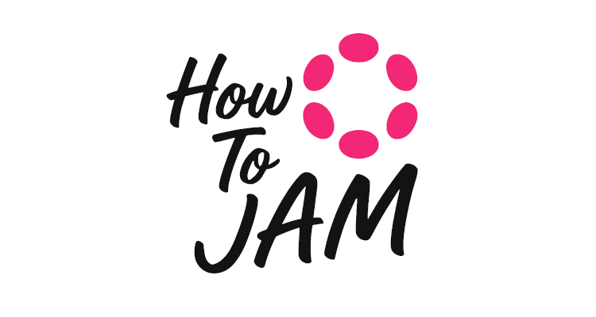

# Learning JAM



> **Polkadot Blockchain Academy Alumni - Lucerne**

A Deep Dive into the Join-Accumulate Machine (JAM) of Polkadot.

---

This book is a companion guide to the *Gray Paper* of the Join-Accumulate Machine (JAM), the next-generation core protocol of the Polkadot network.

Its goal is twofold:

1. To provide a detailed and accessible interpretation of the Gray Paper, clarifying the technical foundations and formal logic behind JAM.
2. To teach readers how to develop JAM programs in Rust, helping developers understand the execution model, data structures, and principles behind Polkadot 2.0.

Whether you're a researcher trying to make sense of JAM's formal semantics, or a developer aiming to build the next killer parachain, this book aims to bridge the theory and practice.

## Requirements

Building this book requires [mdBook](https://github.com/rust-lang/mdBook). To install it:

[mdBook]: https://github.com/rust-lang/mdBook

```bash
cargo install mdbook
```

### `mdbook` usage

To build the book locally, use the `build` sub-command:

```bash
mdbook build
```

The output will be placed in the `book` subdirectory. To check it out, open the `index.html` file in your web browser. You can pass the `--open` flag to `mdbook build` and it'll open the index page in your default browser (if the process is successful) just like with `cargo doc --open`:

```bash
mdbook build --open
```

There is also a `test` sub-command to test all code samples contained in the book:

```bash
mdbook test
```

## Contributing

Learning JAM is a community-driven effort. If you find errors, unclear explanations, or have suggestions, we encourage you to open an issue or submit a pull request.

If your contribution is significant or structural, please open an issue beforehand so we can discuss the direction together.
